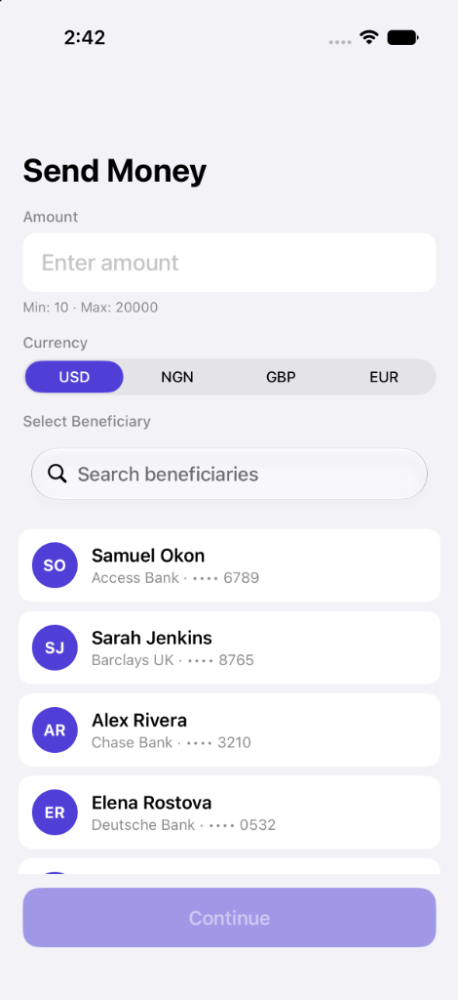

# Send Money Lite — iOS Take-Home Assignment

A simple money transfer application built with **100% programmatic UIKit**, **Swift Concurrency (`async/await`)**, and **MVVM architecture**.

<p align="center">
  
</p>

---

## Architecture & Structure

The project follows the **Model-View-ViewModel (MVVM)** pattern with protocol-oriented service boundaries to keep presentation, business logic, networking, and storage clearly decoupled.

```
raenest-test/
├── Models/
│   ├── Beneficiary.swift          # Beneficiary model & JSON decoding
│   ├── ValidationRules.swift      # Dynamic validation rules schema
│   └── Payments.swift             # Payment request/response models & errors
├── ViewModels/
│   ├── SendMoneyViewModel.swift   # Screen 1 state, search/filtering, validation
│   └── ConfirmationViewModel.swift# Screen 2 payment flow, biometric orchestration
├── Views/
│   ├── SendMoneyViewController.swift    # Screen 1: Amount & Beneficiary selection
│   ├── BeneficiaryCell.swift            # Custom card-style list cell
│   └── ConfirmationViewController.swift # Screen 2: Review, Biometric trigger & status
├── Services/
│   ├── ValidationService.swift    # Runtime validation rules loader & rules engine
│   ├── BeneficiaryService.swift   # Local JSON beneficiary loader & search
│   ├── SecurityServices.swift     # Keychain token storage & LocalAuthentication (Face ID/Touch ID)
│   └── PaymentService.swift       # Protocol-driven mocked POST /send client
├── Resources/
│   ├── validation_rules.json      # Dynamic validation thresholds & allowed currencies
│   └── beneficiaries.json         # Pre-populated mock beneficiaries
├── Assets.xcassets/               # Color catalog (Dynamic Primary with Light/Dark mode)
└── Theme.swift                    # Centralized design tokens & semantic colors
```

---

## Key Technical Decisions

1. **Protocol-Driven Services for Dependency Injection**:
   - `PaymentServiceProtocol` abstracts the network layer so the mocked implementation can be swapped for a live `URLSession` / REST API client without modifying ViewModels or UI.
   - `BiometricServiceProtocol` enables unit testing of biometric authentication states (success, cancellation, errors) without requiring physical hardware sensors.

2. **Programmatic UIKit (AutoLayout without Storyboards/XIBs)**:
   - Views and layouts are constructed programmatically with native AutoLayout constraints, making code reviewable, merge-conflict free, and dynamic.

3. **Keychain & Secure Storage**:
   - Authentication tokens are persisted securely using `kSecClassGenericPassword` with a fallback strategy to guarantee smooth execution across simulators and real devices.
   - A mock token is pre-populated on app launch in `AppDelegate` so transactions can be authenticated immediately.

4. **Biometric Security (LocalAuthentication)**:
   - Integrates `LAContext` with `evaluatePolicy` to protect payment authorization with Face ID or Touch ID where available, with graceful fallback to device passcode.

5. **Dynamic Runtime Configuration**:
   - `validation_rules.json` is loaded and decoded at runtime rather than hardcoded in Swift, supporting dynamic updates to min/max amounts and currency lists.

6. **Swift Concurrency**:
   - All asynchronous flows (biometric prompts, payment dispatch) use native `async/await` and `@MainActor` thread-safety.

7. **Code Quality & Linting (SwiftLint)**:
   - Configured via `.swiftlint.yml` and integrated as an Xcode Run Script build phase to ensure consistent formatting and clean code style across the codebase.

---

## Assumptions

- **Mock Authentication Token**: Pre-populating a mock token in the Keychain on first launch satisfies the requirement without requiring a user login/registration flow.
- **Beneficiaries Data**: Beneficiaries are bundled locally via `beneficiaries.json` and filtered locally via case-insensitive search matching name, bank, or account number.
- **Biometric Availability**: If biometrics are not configured or available (e.g., on older simulator setups), the app falls back to device passcode authentication or provides clear error feedback.

---

## Approximate Time Spent

6 hours

---

## Known Limitations

- **Simulated Network Call**: The `MockPaymentService` uses an artificial 1-second delay (`Task.sleep`) rather than a live network connection.
- **Offline / Caching**: Beneficiary data is read directly from bundled JSON on launch; changes are not persisted across app re-installs.
- **Currency Conversion**: Screen 1 allows selecting from allowed currencies (`USD`, `NGN`, `GBP`, `EUR`), but does not perform live FX rate conversions.
